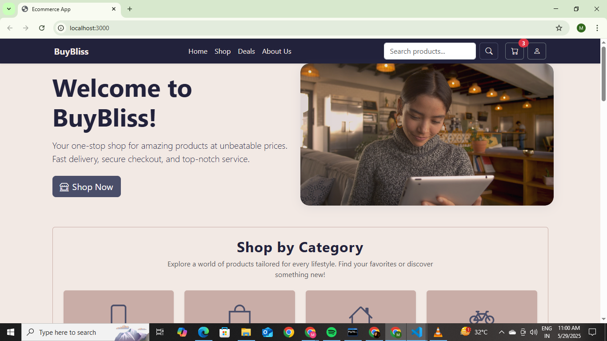

# BuyBliss E-Commerce App
BuyBliss is a modern e-commerce web application featuring a React frontend and a Node.js/Express backend with MongoDB.  
It supports dynamic product listings, customer testimonials, category browsing, newsletter signup, and more.

---

## 🚀 Features

- Modern UI with React and Bootstrap
- Dynamic product and testimonial fetching from backend API
- Category browsing
- Newsletter signup (UI only)
- Trusted Partners section
- Responsive design
- Node.js/Express backend
- MongoDB integration

---

## 🗂️ Project Structure

ecommerce-app/
│
├── backend/ # Node.js/Express/MongoDB backend
│ ├── config/
│ ├── controllers/
│ ├── middleware/
│ ├── models/
│ ├── routes/
│ ├── server.js
│ └── package.json
│
├── frontend/ # React frontend
│ ├── public/
│ ├── src/
│ │ ├── assets/
│ │ ├── components/
│ │ ├── pages/
│ │ ├── App.js
│ │ ├── index.js
│ │ └── theme.css
│ └── package.json
│
└── README.md

---

## ⚙️ Prerequisites

- Node.js (v16+ recommended)
- npm
- MongoDB (local or Atlas)

---

## 🛠️ Setup Instructions

### 1. Clone the Repository

git clone https://github.com/MitiPatel205/buybliss-ecommerce.git
cd ecommerce-app

---

### 2. Backend Setup

cd backend
npm install

- Create a `.env` file in `/backend` and add your MongoDB URI:
MONGO_URI=mongodb://localhost:27017/buybliss
PORT=5000
JWT_SECRET=your_jwt_secret
- Start the backend server:
npm start
The backend will run on [http://localhost:5000](http://localhost:5000).

- **Test your API:**  
Visit [http://localhost:5000/api/products](http://localhost:5000/api/products)  
and [http://localhost:5000/api/testimonials](http://localhost:5000/api/testimonials)  
to see sample data.

---

### 3. Frontend Setup

cd ../frontend
npm install
- (Optional) Create a `.env` file in `/frontend` for API URL:
REACT_APP_API_URL=http://localhost:5000

- Start the frontend React app:

npm start
The frontend will run on [http://localhost:3000](http://localhost:3000).

---

## 🖥️ Usage

- Open [http://localhost:3000](http://localhost:3000) in your browser.
- Browse products, view testimonials, and explore categories.
- Newsletter signup is UI-only (backend integration optional).
- Products and testimonials are fetched from the backend API.

---

## 🧩 Key Files

| Path                          | Purpose                                  |
|-------------------------------|------------------------------------------|
| `backend/server.js`           | Main Express server                      |
| `backend/routes/products.js`  | Product API endpoints                    |
| `backend/routes/testimonials.js` | Testimonials API endpoints             |
| `frontend/src/pages/Home.jsx` | Main homepage, fetches products/testimonials |
| `frontend/src/components/`    | Reusable UI components                   |

---

## 🐞 Troubleshooting

- **Port in use / Permission denied:**  
Change the port in `backend/server.js` if 5000 is unavailable.
- **CORS errors:**  
Ensure `cors` is enabled in your backend (`app.use(cors())`).
- **API returns 403 or not found:**  
Check that your backend server is running and routes are correctly defined.
- **Frontend not showing products/testimonials:**  
- Make sure backend is running.
- Check browser DevTools > Network tab for API calls and errors.
- Try visiting API URLs directly.

---

## 📦 Example API Data

**Products:**  
`GET /api/products` returns an array of product objects.

**Testimonials:**  
`GET /api/testimonials` returns an array of testimonial objects.

---

## 🙌 Credits

- [React](https://reactjs.org/)
- [Express](https://expressjs.com/)
- [MongoDB](https://www.mongodb.com/)
- [Bootstrap](https://getbootstrap.com/)
- [Bootstrap Icons](https://icons.getbootstrap.com/)

---

## 📄 License

This project is licensed under the MIT License.

---

**Happy Shopping with BuyBliss!**  
If you have any issues, please open an issue or contact the maintainer.
